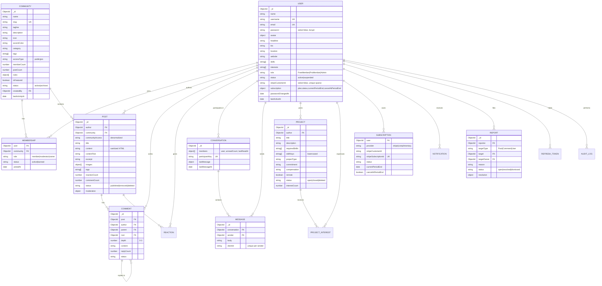

# Database design

MongoDB with Mongoose. The deployment target is a standalone server (no transactions), so consistency
comes from unique indexes, atomic `$inc` counters and idempotent writes.

## ER diagram

Supporting collections: `RefreshToken` (hashed, TTL), `Notification` (TTL 180 days),
`StripeEvent` (idempotency, TTL 30 days), `AuditLog`.

## Modelling decisions

**Membership is its own collection.** Member lists are unbounded, so embedding them in users or
communities would grow documents without limit. A unique `{ user, community }` index makes double joins
impossible even under concurrent requests, and `Community.memberCount` is maintained with atomic `$inc`.

**`Post.communityAccess` is denormalized.** The feed must exclude Pro-only content for Free members. Storing
the access type on the post turns that into an indexed filter instead of a join; changing a community's
access type runs one `updateMany`.

**Comments use an adjacency list plus a `root` pointer.** A post page loads one page of root comments,
then *all* their descendants in a single `root ∈ [...]` query, building the tree in memory — two queries,
no recursion, no `$graphLookup`. Depth is capped at 4.

**Reactions are documents, not an array on the post.** A unique `{ user, post }` index makes liking
idempotent under concurrency, and the same index answers "which of these posts did I like?" for a whole
feed page in one query.

**Conversations carry per-member state.** `members: [{ user, unreadCount, lastReadAt }]` keeps unread
counts O(1) via positional `arrayFilters` updates, and `participantKey` (the sorted id pair, unique)
guarantees exactly one conversation per pair.

**Soft deletion** on posts, comments and projects keeps threads, counters and moderation history coherent.

## Indexes

Indexes follow real query patterns rather than being added everywhere.

| Collection | Index | Serves |
| --- | --- | --- |
| User | `username` (u), `email` (u) | login, profiles, admin prefix search |
| | `stripeCustomerId` (u, sparse) | webhook → user resolution |
| | `role + status`, `createdAt` | admin filters and metrics |
| | text: name, username, headline, skills | member search |
| Community | `slug` (u) | routing |
| | `status + category + memberCount`, `status + isFeatured + memberCount` | directory |
| | text: name, tagline, description, tags | search |
| Membership | `user + community` (u) | duplicate prevention, membership checks |
| | `community + status + role + joinedAt` | member lists, moderators |
| | `user + status + joinedAt` | "my communities", joined feed |
| Post | `community + status + createdAt` | community board |
| | `status + communityAccess + createdAt` | global feed with Pro filtering |
| | `author + status + createdAt` | profile posts |
| | `tags`, text: title, contentText, tags | tag and text search |
| Comment | `post + parent + createdAt` | root comment pages |
| | `root + createdAt` | descendant fetch |
| Reaction | `user + post` (u) | toggle + viewer state |
| Conversation | `members.user + lastMessageAt` | inbox |
| | `participantKey` (u) | one conversation per pair |
| Message | `conversation + createdAt` | history pagination |
| | `sender + createdAt` | Free-tier quota |
| | `sender + clientId` (u, partial) | idempotent retries |
| Notification | `recipient + readAt + updatedAt` | unread list and badge |
| | `createdAt` TTL 180d | retention |
| Subscription | `stripeSubscriptionId` (u, sparse), `user + updatedAt` | webhook sync, entitlement |
| Project | `status + createdAt`, `status + skillKeys + createdAt` | board and skill filters |
| | text: title, summary, description, requiredSkills | search |
| ProjectInterest | `project + user` (u) | one interest per member |
| Report | `status + createdAt` | moderation queue |
| | `reporter + targetType + target` (u, partial on open) | one open report per reporter |
| RefreshToken | `tokenHash` (u), `family`, `expiresAt` TTL | rotation and reuse detection |
| StripeEvent | `eventId` (u), `createdAt` TTL 30d | webhook idempotency |

`syncIndexes()` runs in the seed script and the test bootstrap so text indexes always exist.
